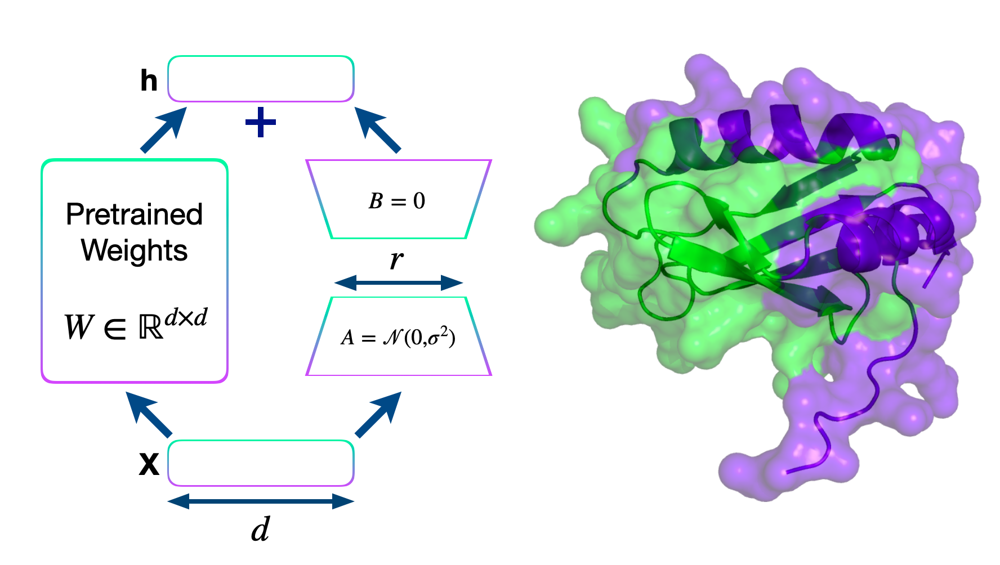

# ESM_FineTuning
This repository contains some scripts and Jupyter notebooks exploring how we can fine tune ESM2 protein language model for our custom requirements.

## Protein binding site prediction:

This [notebook](https://github.com/nidhinthomas-ai/ESM_FineTuning/blob/main/esm_binding_site_prediction.ipynb) shows how we can fine tune ESM2 for predicting the protein binding sites based on the amino acid sequence information alone. This notebook is based on the repository published by AmelieSchreiber (https://huggingface.co/blog/AmelieSchreiber/esmbind). 
